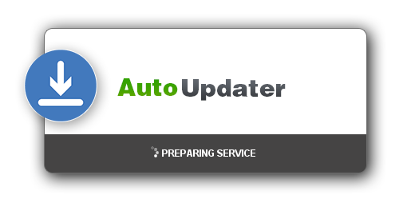

# Auto-Updater 



## About 
Auto-Updater is a software updating service that allows users to easily manage and push updates to their clients  
Updates are simply maintained on an FTP server and then automatically pushed to clients  
Auto-Updater is highly customizable and offers a wide range of features to assist with update management

## How it works
- Auto-Updater first connects to the patching FTP server and compares
the local client version with the server version and begins to update if the client is out of date
- The FTP server maintains all the patches in compressed zips whereby the patch names comply to a  
patch naming convention i.e. build numbers
- If the client is out of date, Auto-Updater proceeds to download and unpack the patches into a  
specified directory on the client 
- After each update, Auto-Updater modifies the client version to the new patched version  
- Auto-Updater continues downloading and unpacking patches until the client is up to date

## Installation
- [Download](https://github.com/kyleruss/auto-updater/releases/latest) the latest release
- Unzip the contents into the root directory of the client application you wish to keep updated
- Configure the FTP connection and hook settings in Auto-Updater in `data/conf/config.xml`  
- Set the client version in `data/conf/version.xml` to the current client version
- Setup your FTP server with patches to push and a Auto-Updater `version.xml` file

## Setting up the FTP Server

- Add the application server version file `version.xml` to the FTP Server
The FTP server should have a version file that keeps track of the latest
client version so that Auto-Updater can check it, compare it to a current client version  
and then download all patches that are missing prior to the latest version  
The server `version.xml` file is the same as its client counterpart and should look like this:

```
<?xml version="1.0" encoding="UTF-8" standalone="no"?>
<app-version>
  <build-id>100</build-id>
  <build-date>03-03-17</build-date>
  <build-version>1.0</build-version>
</app-version>

```

- Add the patches to the FTP Server  
The FTP server needs to maintain all patches that are available for the application  
A patch can contain files and directories  
Each patch must be zipped up and follow the patch naming convention  
By default Auto-Updater uses build numbers for patches i.e. `101.zip`  
Patch zips must be in the same FTP directory as the server `version.xml`  

- FTP Server file structure example
```
100.zip
101.zip
102.zip
version.xml
```


## Configuration   

- Connection config  
This component of the config sets the FTP server connection properties  
For a local server the hostname can be left as `127.0.0.1` otherwise the global IP will need to be specified  
The username and password of your FTP server user needs to be included, this user account should have  
read & write privledges to download from the server and update version files 

```
<connection-config>
  <!-- FTP server address/IP -->
  <hostname>127.0.0.1</hostname>

  <!-- FTP server port (201 default) -->
  <port>201</port>

  <!-- FTP server user -->
  <username>ftpguest</username>

  <!-- FTP server users password -->
  <password>ftppassword</password>
</connection-config>
```

- Behaviour config  
These configs set how the Auto-Updater behaves after it has finished updating  
At minimum you will need to set the `exit-launch-path` as the path to the file you wish to launch if an update is successful  
Auto-Updater will execute (if `enable-exit-launch` is set true) the application and  
pass a parameter indicating the status of the update  
You can force Auto-Updater to continue to launch the application even if an update failed and you can  
also disable launching the application


```
<!-- Update completion/exit behaviour settings -->
<behaviour-config>
  <!-- Enable/disable forced launch of application
     If true, application will attempt to launch even if update failed
  -->
  <force-launch>true</force-launch>

  <!-- Enable/disable launching of a application after update completion -->
  <enable-exit-launch>true</enable-exit-launch>

  <!-- Status paramater name to pass to executing application -->
  <status-arg-name>s</status-arg-name>

  <!-- Path to executing application -->
  <exit-launch-path>data/graphi.jar</exit-launch-path>
</behaviour-config>
```

- Interface Config  
Here you can enable/disable the GUI completely as well as set the splash image

- Log Config  
Auto-Updater has optional logging which include error and update logs    
You can enable/disable logging,  set the log paths and log sizes

- Patch Config  
These settings change the paths of client, server and output patching directories  
By default Auto-Updater will unpack all patches in the root of the application folder  
The version naming type can also be changed 

## License
Auto-Updater is available under the MIT License  
See [LICENSE](LICENSE) for more details
